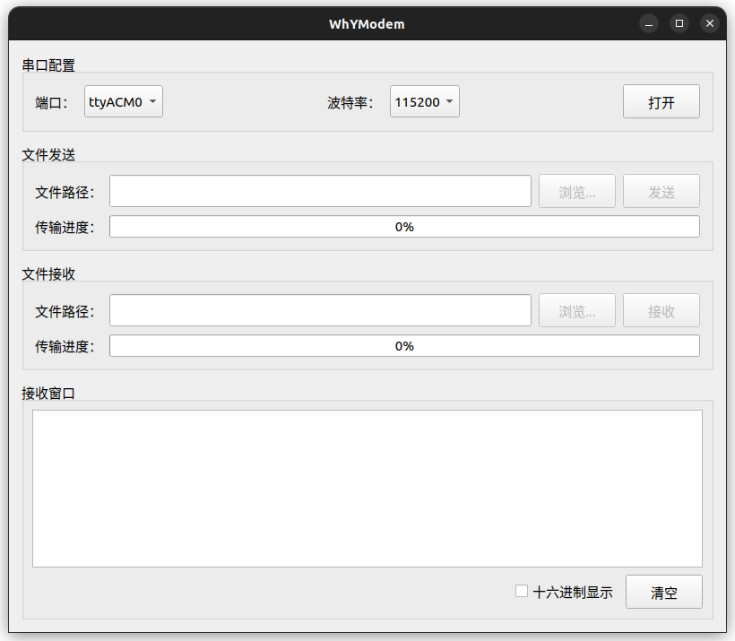

# WhYModem

WhYModem 是一个通过串口 YMODEM 协议进行文件传输的工具软件，非常小巧易用。程序中涉及到 YMODEM 协议知识，详细介绍见维基百科 [YMODEM](https://en.wikipedia.org/wiki/YMODEM)。

## 软件架构

工程主体位于当前目录：

* `src/main.cpp`：创建 `QApplication`、设置应用图标并显示主窗口。
* `src/ui/`：主界面，负责串口选择、波特率选择、文件/目录选择、发送/接收按钮状态和进度条。
* `src/protocol/ymodem/`：YMODEM 协议状态机，不依赖 Qt 串口或文件 API。
* `src/transfer/`：串口文件收发适配层，将协议读写回调连接到 `QFile` 和 `QSerialPort`。当前实现使用 YMODEM，文件名和类名不绑定协议名前缀，方便后续扩展 XMODEM/ZMODEM。
* `resources/`：应用图标和 Qt 资源文件。
* `packaging/`：打包脚本与 Linux 桌面入口文件。
* `docs/`：平台相关的构建与打包文档。

依赖模块为 Qt Widgets、Qt SerialPort 和 Qt Core/Gui。

## 推荐开发环境

当前已在 Ubuntu 22.04 上使用 Qt 5.15.3 验证通过。建议使用：

* Qt 5.15 LTS 或 Qt 6.x
* CMake 3.16+
* Linux：GCC/G++ 或 Clang/Clang++
* Windows：MSVC 或 MinGW
* IDE：Qt Creator、Visual Studio、CLion，或命令行

原始工程创建环境为 Qt 5.7.1、MSVC2015_64bit、Qt Creator 4.2.0、Windows 10。

## Linux 构建与运行

### 安装依赖

Ubuntu 22.04 使用 Qt 5：

```bash
sudo apt update
sudo apt install build-essential cmake qtbase5-dev libqt5serialport5-dev
```

如果使用 Qt 6：

```bash
sudo apt update
sudo apt install build-essential cmake qt6-base-dev qt6-serialport-dev
```

### 使用 CMake 构建

在 WhYModem 目录执行：

```bash
cmake -S . -B build -DCMAKE_BUILD_TYPE=Release
cmake --build build --parallel
./build/WhYModem
```

如果系统没有 `g++`，但有 `clang++`，CMake 通常可直接使用 `/usr/bin/c++` 完成构建。

### 安装桌面/Dock 图标

安装后会生成 Ubuntu 应用菜单和 Dock 可识别的桌面入口：

```bash
sudo cmake --install build --prefix /usr/local
```

安装内容包括：

* 可执行文件：`/usr/local/bin/WhYModem`
* 桌面入口：`/usr/local/share/applications/io.geekat.WhYModem.desktop`
* 图标：`/usr/local/share/icons/hicolor/512x512/apps/io.geekat.WhYModem.png`

### 串口权限

Linux 下普通用户可能没有串口访问权限。将用户加入 `dialout` 组后需要重新登录：

```bash
sudo usermod -aG dialout "$USER"
```

常见串口名称为 `/dev/ttyUSB0`、`/dev/ttyACM0` 或板载串口设备名；程序会通过 `QSerialPortInfo::availablePorts()` 扫描可用串口。

## Windows 构建与运行

### 使用 Qt Creator

1. 安装 Qt 5.15 或 Qt 6，并勾选 Qt SerialPort 组件。
2. 用 Qt Creator 打开 `CMakeLists.txt`。
3. 选择 MSVC 或 MinGW Kit。
4. 构建并运行。

### 使用命令行 CMake

以 Qt 6/MSVC 为例，按实际 Qt 安装路径调整 `CMAKE_PREFIX_PATH`：

```bat
cmake -S . -B build -G Ninja -DCMAKE_PREFIX_PATH=C:\Qt\6.6.3\msvc2019_64
cmake --build build --config Release
build\WhYModem.exe
```

如果使用 MinGW，请在 Qt 的 MinGW 环境中运行，并确保 `cmake`、`ninja` 或 `mingw32-make` 在 `PATH` 中。

### Windows 打包发布

Release 构建完成后，使用 `windeployqt` 收集依赖并生成 ZIP：

```powershell
.\packaging\deploy-windows.ps1
```

或：

```bat
packaging\deploy-windows.bat
```

详细步骤、参数说明和常见问题见 [docs/windows-build-and-package.md](docs/windows-build-and-package.md)。

## DEB 打包

Ubuntu 上使用 CPack 生成 deb：

```bash
cmake -S . -B build -DCMAKE_BUILD_TYPE=Release
cmake --build build --parallel
cmake --build build --target package
```

生成的安装包位于 `dist/` 目录，当前验证生成的文件名为 `whymodem_0.1.0_amd64.deb`。

安装 deb：

```bash
sudo apt install ./dist/*.deb
```

deb 包会安装可执行文件、桌面入口和 512x512 PNG 图标。安装完成后可以在 Ubuntu 应用菜单中搜索 `WhYModem`，也可以启动后固定到 Dock。

## 已验证结果

在当前 Ubuntu 22.04 环境中已验证：

```bash
cmake -S . -B build -DCMAKE_BUILD_TYPE=Release
cmake --build build --parallel 2
timeout 5s env QT_QPA_PLATFORM=offscreen ./build/WhYModem
cmake --build build --target package
```

程序可成功编译并启动进入 Qt 事件循环；`timeout` 退出码为 124 属于预期，因为 GUI 程序会持续运行。真实 YMODEM 收发需要连接串口设备后再验证。

## 软件界面


